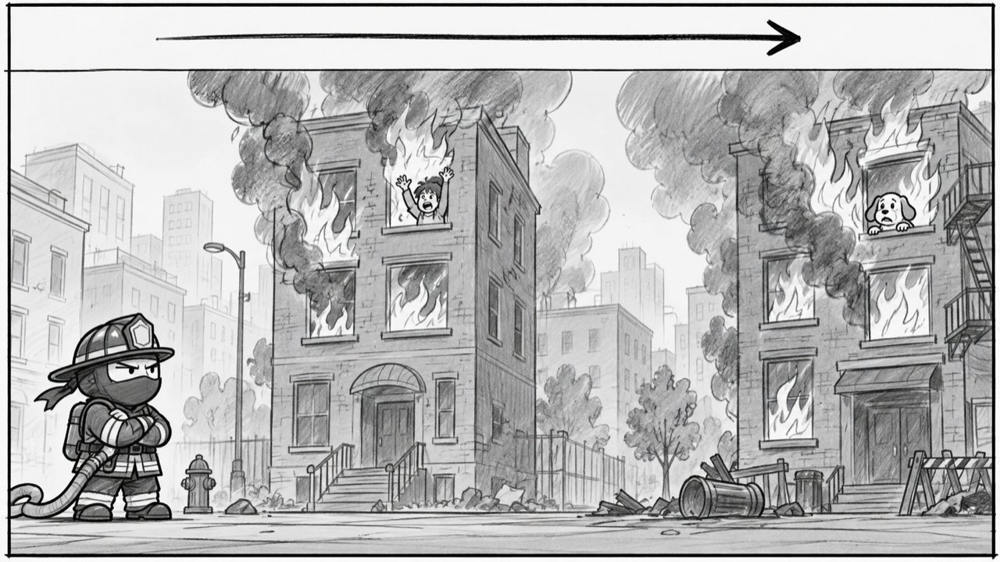
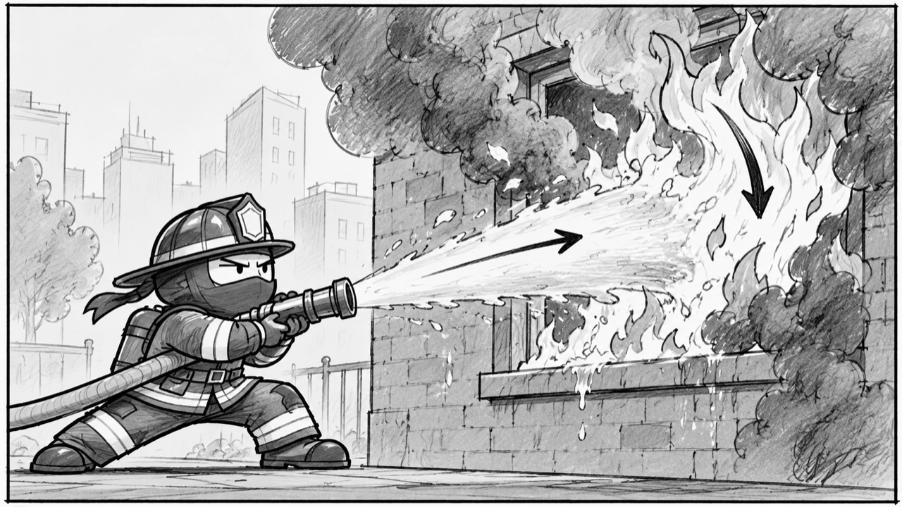
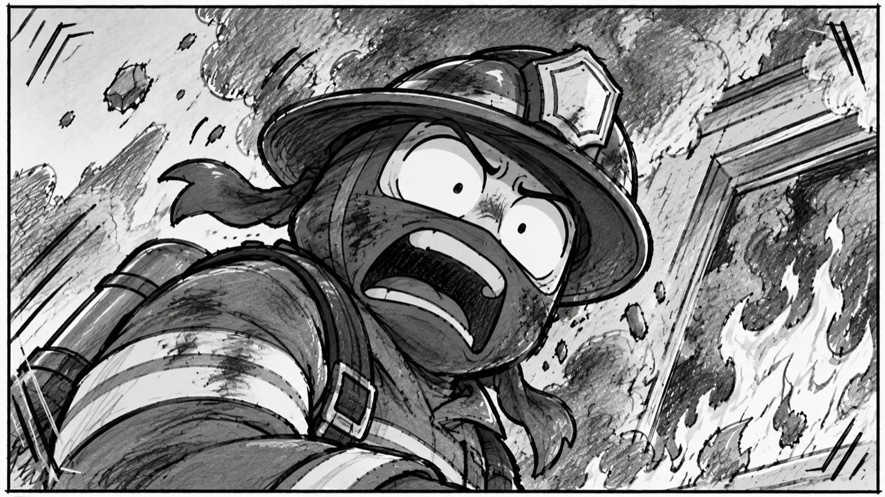
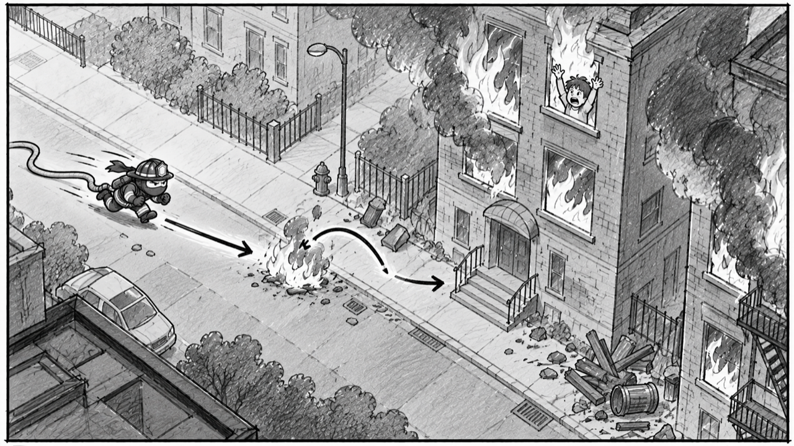
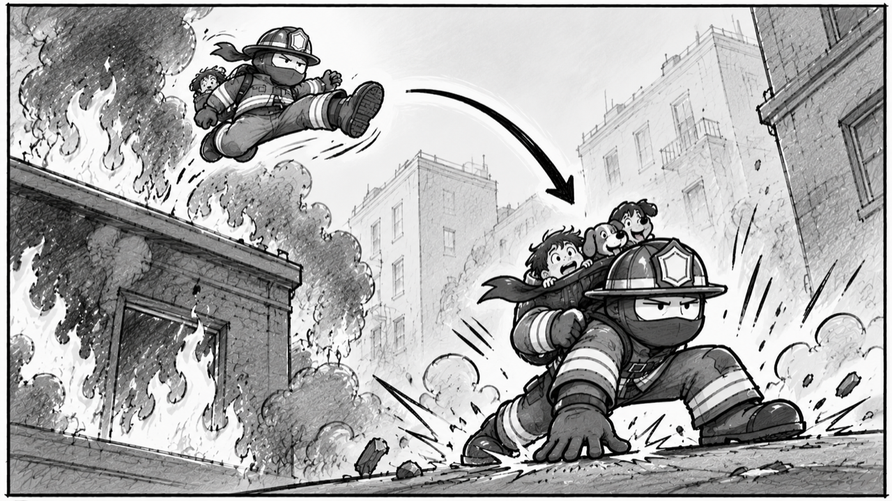

# STORYBOARD — Extinguisho, the ninja firefighter

> v1 · 2026-10-01 · written before any generation. The panel sketches go in `design/storyboard/`. Later revisions are added below, not rewritten.

## The idea this storyboard has to sell

Extinguisho is a **ninja firefighter**. He does an ordinary firefighter's job (hose the fire, carry people out, escape the building), but **every move is performed like a martial-arts movie**, and **every sound is exaggerated the same way**. The comedy comes from the gap between how dramatic his moves and sounds are and how bored his face stays. Nothing impresses him, except fire touching him, and then his face falls apart like a comic-book panel.

The four pillars from CONCEPT.md, and how each one shows up in movement and sound:

| Pillar | How the ninja exaggeration shows it |
|---|---|
| **Race the flames** | Fast, drum-led music with a martial-arts flavor runs under every panel of play; the 40-second countdown is always visible. |
| **Too cool to care** | His face stays flat and grumpy through flips, kicks, and rescues. Routine actions get crisp, understated sounds; he never cheers. |
| **Every move is a kata** | Walking is a sneaky ninja shuffle, a jump is a flying kick with a sharp "whoosh," a landing is a three-point superhero crouch with a heavy thud, and hosing is done from a wide martial-arts stance. |
| **Failure is a punchline** | When fire touches him, the cool act breaks: a giant devastated comic-book face, smoke puffs, and an over-the-top cartoon yelp, followed by a fast retry so the joke never gets old. |

## How the panels cover the rules

- **Frame shape:** 16:9 for every panel, the same shape as the game window (640×360).
- **Gameplay panels** show what the game camera shows: a side view, eye level, following Extinguisho left to right. **Design panels** are moments framed differently on purpose, to set how the world and character should feel. Each panel is labeled.

| Panel | Moment (required) | Shot size | Angle | Motion | View |
|---|---|---|---|---|---|
| 1 | First thing the player sees | wide | eye level | camera pans across the street | design (title) |
| 2 | Core action | medium | eye level | water-stream arrow, flame shrinking | gameplay |
| 3 | Success | medium | low angle | jump arrow, "SAVED!" rising | design |
| 4 | Failure | close-up | eye level, tilted (Dutch) | smoke puffs, camera shake | design |
| 5 | Retry | wide | high angle | run arrow, camera follows | design |
| 6 | End of the session | medium | low angle | leap arc, landing impact lines | design |

**Totals:** 3 shot sizes (wide, medium, close-up); 4 angles (eye level, low, high, tilted); motion on all 6 panels.

---

## Panel 1 — First look: the burning street

- **Shot:** wide · eye level · design view (title screen) · motion: slow camera pan from left to right across the whole street.
- **Player action:** the player sees the title card and presses Enter to start. The game drops Extinguisho at the start line, and the 40-second countdown begins.
- **See:**
  - Two burning buildings across the street, flames in the windows, smoke rising, and a "HELP!" bubble from a trapped person and a trapped dog.
  - Extinguisho small at the left edge, standing in his **idle pose**: arms crossed, chin up, grumpy, completely unbothered by the inferno in front of him.
  - The title "Extinguisho."
- **Hear:**
  - Before starting: the music is quiet or off, with only distant fire crackle.
  - On Enter: the drum-led music kicks in at full speed.
- **Assets:** ENV-BG, ENV-FIRE, CHAR-IDLE, MUS-LOOP
- **Design reason** (pillars "Race the flames" + "Too cool to care"): in one glance the player should understand the job (two buildings, people trapped, a clock running) and the joke (the hero does not care how scary it is).

## Panel 2 — Core action: hosing the blocking fire

- **Shot:** medium · eye level · gameplay view · motion: arrow along the water stream from the hose to the fire; the flames drawn shrinking from tall to small.
- **Player action:**
  - The player reaches the large fire blocking the trapped person's window. The prompt "Press W to hose the fire" appears.
  - The player taps W. The water pours for about 4 seconds while the flames shrink, and the player waits it out, watching the clock.
- **See:**
  - Extinguisho in his **hose-spray pose**: a wide, low martial-arts stance, one leg forward, the hose held out like a weapon in a kung-fu movie.
  - His face still bored, as if hosing a giant fire were a chore.
  - The water stream hitting the fire, and the flames shrinking.
- **Hear:**
  - **SFX-HOSE:** an exaggerated, high-pressure blast, overdramatic for what is just water.
  - The music keeps driving underneath; it does not let up while he waits.
- **Assets:** CHAR-SPRAY, CHAR-IDLE, ENV-FIRE, SFX-HOSE, MUS-LOOP
- **Design reason** (pillar "Every move is a kata"): the core verb, putting out fire, should feel like a martial-arts technique, not a chore. It also costs time, which keeps the urgency.

## Panel 3 — Success: the rescue

- **Shot:** medium · low angle (camera looking up at him) · design view · motion: arrow showing his leap into the window; "SAVED!" text drifting upward.
- **Player action:** the fire is out; the player walks into the window and touches the trapped person. The game marks them rescued, and they ride along in his rescue bag.
- **See:**
  - Extinguisho in his **rescue pose**: he scoops the person up in one smooth, heroic, kung-fu-movie motion, shot from below like a hero.
  - His face, again, totally deadpan: no smile, no celebration.
  - "SAVED!" floating up; the person's head now visible in his bag.
- **Hear:**
  - **SFX-RESCUE:** a short, bright sting, with a little martial-arts flourish.
  - The music continues.
- **Assets:** CHAR-RESCUE, ENV-BG, SFX-RESCUE, MUS-LOOP
- **Design reason** (pillar "Too cool to care"): the heroic camera angle and his bored face clash on purpose. The player feels the win; Extinguisho refuses to.

## Panel 4 — Failure: fire touches him

- **Shot:** close-up on his face · eye level, tilted (Dutch angle) · design view · motion: smoke puffs rising, camera shake on contact.
- **Player action:** the player misjudges a jump and lands in the flames. The game ends the attempt at once and shows "The fire got you."
- **See:**
  - The **burned pose**: the one moment the cool act breaks. A huge, devastated, comic-book face: eyes wide, mouth open in horror, helmet knocked crooked, soot on his face, smoke rising.
  - The fire that caused it stays visible, so the player knows exactly what killed him.
  - The tilted camera makes the moment feel off-balance and dramatic.
- **Hear:**
  - **SFX-BURN:** an over-the-top cartoon yelp with a sizzle, exaggerated enough to be funny, not upsetting.
  - The music dips under the yelp.
- **Assets:** CHAR-BURNED, ENV-FIRE, SFX-BURN, MUS-LOOP
- **Design reason** (pillar "Failure is a punchline"): dying should make the player laugh, not feel punished, so they want one more try right away.

## Panel 5 — Retry: back at the start, instantly

- **Shot:** wide · high angle (looking down on the street) · design view · motion: a long run arrow from the start line toward the first building; note "camera follows."
- **Player action:** about half a second after the failure, the game puts Extinguisho back at the start with a fresh 40-second clock. The player immediately runs and jumps again.
- **See:**
  - The whole route from above, so the path to the first building is clear.
  - Extinguisho back in his **idle pose** for an instant, as if nothing happened, then the **walk poses**: a low, sneaky ninja shuffle.
  - The fire that got him, back in place, so the player can plan around it.
- **Hear:**
  - The music returns to full and keeps going. It does not restart, so the retry feels seamless.
  - **SFX-JUMP** on the first jump: a sharp martial-arts whoosh.
- **Assets:** CHAR-IDLE, CHAR-WALK-A, CHAR-WALK-B, ENV-BG, ENV-FIRE, SFX-JUMP, MUS-LOOP
- **Design reason** (pillars "Failure is a punchline" + "Race the flames"): a retry should cost almost nothing, so the player's attention goes straight back to beating the clock.

## Panel 6 — End: the rooftop escape and the bow

- **Shot:** medium · low angle · design view · motion: a big leap arc from the roof out through the fire escape; impact lines where he lands.
- **Player action:** with both survivors rescued, the fire escape on the roof unlocks ("JUMP OUT →"). The player jumps out. The game ends the run and shows "Everyone out!" with the number saved, the time, and the retries.
- **See:**
  - The full kung-fu move set in one shot: the **kung-fu stance** before the leap, the **flying-kick rise**, the **falling** pose, and the **three-point landing**.
  - The final **celebrate pose**: a slow, formal, deadpan bow, the most understated "victory" possible.
  - The person and the dog visible in his bag.
- **Hear:**
  - **SFX-JUMP** on the leap.
  - **SFX-WIN:** a big dramatic gong.
  - The music stops, so the gong lands in silence.
- **Assets:** CHAR-STANCE, CHAR-RISE, CHAR-FALL, CHAR-LAND, CHAR-BOW, ENV-BG, SFX-JUMP, SFX-WIN, MUS-LOOP
- **Design reason** (pillars "Every move is a kata" + "Too cool to care"): the ending is the biggest martial-arts moment, and his response to winning is a bored bow. That gap is the joke the whole game is built on.

---

## Readable with sound muted

Every panel must work with no sound:
- the failure has its own pose plus "The fire got you.";
- the rescue has its pose plus "SAVED!";
- the end has its pose plus "Everyone out!";
- the hose prompt and the countdown are on screen.

Sound adds the comedy and the urgency; it never carries information the screen doesn't show.
